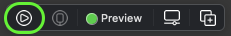
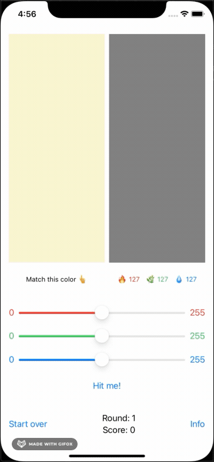

# Section 1: Diving into SwiftUI

- [Chapter 1: Introduction](#chapter-1-introduction)
- [Chapter 2: Getting Started](#chapter-2-getting-started)
- [Chapter 3: Understanding SwiftUI](#chapter-3-understanding-swiftui)
- [Chapter 4: Integrating SwiftUI](#chapter-4-integrating-swiftui)
- [Chapter 5: The Apple Ecosystem](#chapter-5-the-apple-ecosystem)

## Chapter 1: Introduction

Sau nhiều năm xài UIKit và AppKit, SwiftUI giới thiệu một cách mới để khởi tạo giao diện app. Trong một số trường hợp, SwiftUI thực hiện đơn giản nhưng lại hiệu quả hơn so với các ký thuật trước đó, và đặt biệt là nó cross-platform trong Apple ecosystem.

Tuy nhiên, SwiftUI là declarative programming. Nhưng trước đó developer vốn đã quen với imperative programming, các vấn đề về state-management và độ phức tạp của code. Bây giờ, bạn cần học thêm declarative code để làm việc với SwiftUI. Nhưng hem sao đâu, vẫn có cách để integrate từ những framework khác sang SwiftUI.

SwiftUI vẫn đang tiếp tục được phát triển, giống như Swift vẫn đang được phát triển từ version 1.0 tới giờ và SwiftUI cũng sẽ như vậy.

## Chapter 2: Getting Started

Bắt đầu với SwiftUI, bạn cần học những thuật ngữ căn bản, khám phá sức mạnh của việc build interface trực tiếp lên preview canvas. Xem cách mà Swift khiến cho việc viết declarative code dễ dàng hơn và thêm cách kéo/thả trong SwiftUI.

Nội dung trong chapter này:

- Học cách sử dụng Xcode canvas để tạo UI song song với code của nó, xem cách chúng đồng bộ với nhau.
- Tạo reusable view cho slider.
- Học về biến @State và sử dung chúng để cập nhật UI khi state value thay đổi.
- Hiển thị điểm số trên alert.

### Getting Started

Trong SwiftUI project, AppDelegate.swift được tách ra thành AppDelegate.swift và SceneDelegate.swift.

```swift
class SceneDelegate: UIResponder, UIWindowSceneDelegate {

  var window: UIWindow?


  func scene(_ scene: UIScene, willConnectTo session: UISceneSession, options connectionOptions: UIScene.ConnectionOptions) {
    let contentView = ContentView()

    if let windowScene = scene as? UIWindowScene {
        let window = UIWindow(windowScene: windowScene)
        window.rootViewController = UIHostingController(rootView: contentView) // (*)
        self.window = window
        window.makeKeyAndVisible()
    }
  }
  ...
}
```

SceneDelegate bản thân nó không phải đặc điểm của SwiftUI, nhưng dòng code này thì có `window.rootViewController = UIHostingController(rootView: contentView)`.
`UIHostingController` tạo ra một view controller chứa SwiftUI view tên là `contentView`.

`UIHostingController` cho phép bạn integrate SwiftUI view vào một app có sẵn.

Trong đó `ContentView` được định nghĩa với `body` như sau:

```swift
struct ContentView: View {
  var body: some View {
    Text("Hello World")
  }
}
```

### Previewing your ContentView

Phía dưới struct `ContentView`, struct `ContentView_Previews` sở hữu một view chứa một instance của `ContentView`. Mà ở đây bạn có thể thử preview với một số data khác nhau và so sánh kết quả.

```swift
struct ContentView_Previews : PreviewProvider {
  static var previews: some View {
    ContentView()
  }
}
```

Để preview, sử dụng:

- Nút `Resume` để update preview trên canvas.
- Hoặc nhấn tổ hợp `Option+Command+P` để update preview trên canvas.
- Nếu không thấy nút `Resume`, chọn `Editor Options`, chọn `Canvas`.
- Để sắp xếp preview canvas nằm ở phía bên phải/phía dưới, chọn `Editor Options`, chọn `Layout`, chọn `Canvas on Bottom`/`Canvas on Bottom`

### Previewing in landscape

Để preview ở chế độ landscape, hiện tại bạn chỉ có thể xử lý bằng cách khai báo width và height cố định.

Trong `ContentView_Previews`, thêm một modifier cho `ContentView()`:

```swift
struct ContentView_Previews : PreviewProvider {
  static var previews: some View {
    ContentView()
      .previewLayout(.fixed(width: 568, height: 320)
  }
}
```

Ví dụ ở trên 568x320 là size của iPhone SE đang ở chế độ landscape. Tham khảo thêm [iPhone Resolutions](https://www.paintcodeapp.com/news/ultimate-guide-to-iphone-resolutions).

### Creating your UI

SwiftUI app không có storyboard hay view controller. `ContentView.swift` đã đảm nhiệm vai trò đó.

Bạn có thể tạo UI bằng cách:

- Kéo/thả UI component từ trong Library
- Code

SwiftUI có kiểu là declarative programming. Bạn sẽ khai báo UI trông như thế nào, SwiftUI sẽ chuyển đổi những khai báo của bạn thành các dòng code tương đương.

Apple khuyến khích bạn tạo càng nhiều view càng tốt, nhờ vậy mà code của bạn dễ đọc hơn.

Bên cạnh đó, reusable parameterized view rất được khuyến khích sử dụng. Nó giống như việc bóc code rồi tách ra thành một function rứa đó, sẽ được ví dụ rõ hơn ở phần sau của chapter ny.

**Một số thuật ngữ hay dùng trong SwiftUI:**

- Canvas and Minimap: Để trải nghiệm SwiftUI một cách đầy đủ thì ta xài canvas để preview app lên, song song với code editor. Minimap (ai chơi game biết rõ lắm nè) là của map của code.
- Modifiers: Thay vì phải thiết lập các attributes/properties cho UIKit object, bạn có thể gọi các modifier method cho foreground color, font, padding,...
- Container views: Tương tự UIStackView, HStack and VStack là những container view. Ngoài ra còn các container view khác như ZStack và Group.

Bên cạnh container view, còn có các SwiftUI view khác nữa: Text, Button, Slider,...

**Embed in VStack/HStack**

- `Command+Click` vào view trong canvas (ví dụ: `Text` view), chọn `Embed in VStack`/`Embed in HStack`. Lúc này canvas không thay đổi, nhưng VStack đã được thêm vào trong code.

**Show SwiftUI Inspector...**

- `Command+Click` vào view trong canvas (ví dụ: `Text` view), chọn `Show SwiftUI Inspector...`, sau đó edit inspector. Lúc này code sẽ được cập nhật tương ứng với những gì được edit.

**Drag and drop a view**

- Chọn nút `+` trên toolbar để mở `Library`, mỏ tab `Views`, tìm `color`. Kéo thả vào canvas.

```swift
Color(red: 0.5, green: 0.5, blue: 0.5)
```

### Updating the UI

Nếu UI cần thay đổi khi một giá trị thay đổi, bạn phải khai báo variable của giá trị kia là một @State variable.

Trong SwiftUI, khi @State variable thay đổi, view sẽ invalidate và recompute body.

**Using @State variables**

Thêm đoạn code sau vào `ContentView`

```swift
let rTarget = Double.random(in: 0..<1)
let gTarget = Double.random(in: 0..<1)
let bTarget = Double.random(in: 0..<1)
@State var rGuess: Double
@State var gGuess: Double
@State var bGuess: Double
```

Vì rGuess, gGuess và bGuess không có giá trị khởi tạo, nên bạn phải update code ở `SceneDelegate` và ở `ContentView_Previews`:

```swift
let contentView = ContentView(rGuess: 0.5, gGuess: 0.5, bGuess: 0.5)
```

**Updating the `Color` views**

```swift
Color(red: rTarget, green: gTarget, blue: bTarget)
Color(red: rGuess, green: gGuess, blue: bGuess)
```

### Making reusable views

Ba thanh slider về hình thức trông hệt nhau. Vậy nên chúng ta sẽ định nghĩa một slider view trước, sau đó reuse cho hai sliders còn lại.

**Making the red slider**

Đầu tiên, chưa tính tới vấn đề reuse nhe, bạn sẽ tạo red slider trước. Điều cần làm là định nghĩa:

- Giá trị min với `Text`
- Giá trị max với `Text`
- `Slider` nằm ở giữa hai `Text` trên

Để làm vậy thì bạn cần `HStack` như sau:

```swift
HStack {
  Text("0")
    .foregroundColor(.red)
  Slider(value: $rGuess)
  Text("255")
    .foregroundColor(.red)
}
.padding(.horizontal)
```

**Bindings**

Bản thân `rGuess` chỉ là giá trị **read-only**. Trong khi `$rGuess` là **read-write binding**

Để thấy được sự thay đổi trên, tạo `Text` như sau, nhưng bởi vì bạn chỉ cần lấy giá trị của guess value (read-only) cho nên bạn không cần dùng tiền tố `$`:

```swift
Text("R: \(Int(rGuess * 255.0)) G: \(Int(gGuess * 255.0)) B: \(Int(bGuess * 255.0))")
```

Run project, lúc này khi thay đổi red slider, giá trị của R thay đổi.

**Extract subviews**

Để reusable, view cần một số parameters. Vậy ví dụ để áp dụng red slider cho green slider, cần đổi `.red` sang `.green` và `$rGuess` sang `$gGuess`. Vậy nên bạn sẽ cần 2 parameter, được đặt tên là `textColor` và `value`.

`Command+Click` vào red slider `HStack`, chọn `Extract Subview`, sau đó đặt tên là `ColorSlider`. Sau đó chỉnh sửa `ColorSlider`


```swift
struct ColorSlider: View {

  @Binding var value: Double

  var textColor: Color

  var body: some View {
    HStack {
      Text("0")
        .foregroundColor(textColor)
      Slider(value: $value)
        .accentColor(textColor)
        .foregroundColor(textColor)
      Text("255")
        .foregroundColor(textColor)
    }
    .padding(.horizontal)
  }
}
```

Đối với biến `value`, bạn cần dùng `@Binding` thay vì `@State` bởi `Slider` view không sở hữu dữ liệu nào cả, thay vào nó sẽ nhận một giá trị khởi tạo, sau đó thay đổi giá trị đó.

Quay lên nơi khởi tạo `ColorSlider()`, thêm các parameter mới:

```swift
ColorSlider(value: $rGuess, textColor: .red)
ColorSlider(value: $gGuess, textColor: .green)
ColorSlider(value: $bGuess, textColor: .blue)
```

**Live Preview**

Không cần chạy Simulator, chế độ `Live preview` cho phép chạy thử game.



### Presenting an alert

Để present `Alert` sau khi ấn vào một `Button`, đầu tiên ta cần định nghĩa một `Button` có một action và một label như sau:

```swift
Button(action: {}) {
  Text("Hit me!")
}
```

Action bạn cần là hiển thị `Alert` view, tuy nhiên nếu bạn khởi tạo một `Alert` ngay bên trong action closure, nó sẽ chả thực hiện gì cả.

Thay vào đó, bạn cần phải định nghĩa `Alert` như là một subview của `ContentView` và một biến `@State` có kiểu `Bool`. Mỗi khi bạn thay đổi giá trị của biến này thành `true`, là lúc `Alert` view xuất hiện, giá trị phải được set trong action của `Button`. Ngược lại, giá trị đổi thành `false` thì `Alert` được ẩn đi.

```swift
struct ContentView: View {
  ...
  @State var showAlert = false
  ...
  var body: some View {
    ...
    Button(action: { showAlert = true }) {
      { Text("Hit me!") }
    }
    .alert(isPresented: $showAlert) {
      Alert(title: Text("Hello"), message: Text("SwiftUI"))
    }
    .padding()
  }
}
```

Pass `$showAlert` binding vì giá trị này sẽ thay đổi khi user dismiss alert, và giá trị này khi thay đổi sẽ làm UI thay đổi.

### Challenge

[Challenge example reference](./example/chapter-2/challenge)



## Chapter 3: Understanding SwiftUI

SwiftUI thay đổi cách chúng ta nghĩ về view, data và control. Học cách suy nghĩ khác với UIKit, cách UIViewController được thay thế bởi các concept tốt hơn @ObjectBinding và @EnvironmentObject

## Chapter 4: Integrating SwiftUI

Check how SwiftUI and UIKit/AppKit can be good friends and work together, side-by-side by integrating them in a single app. Learn how to navigate between both implementations and how to create and manage SwiftUI packages and frameworks.

## Chapter 5: The Apple Ecosystem

Check the differences between Apple´s platforms when dealing with SwiftUI. Learn how to focus on getting the best use of the device, its unique features and its way to handle input. Customize an app and update it for AppKit, UIKit, WatchKit, tvOS, iPadOS and Catalyst.