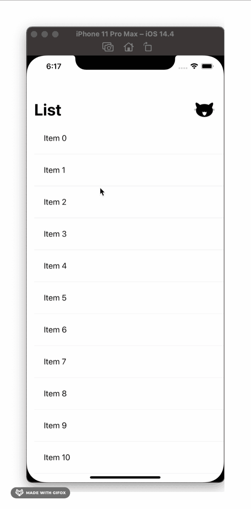
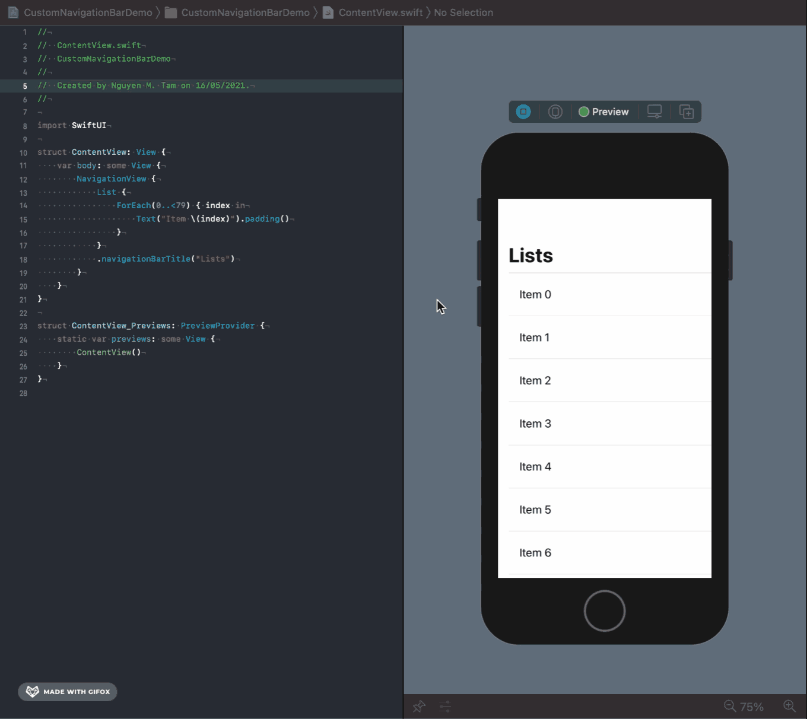
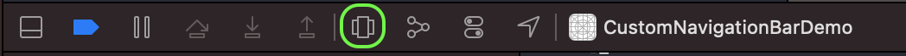
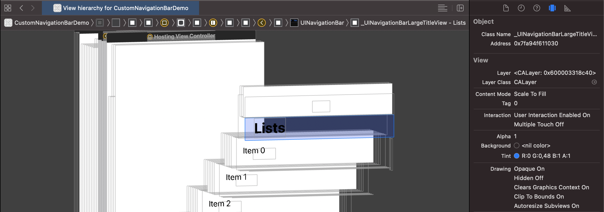
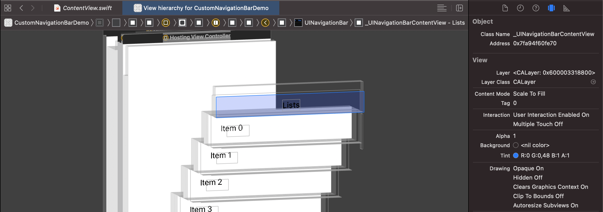
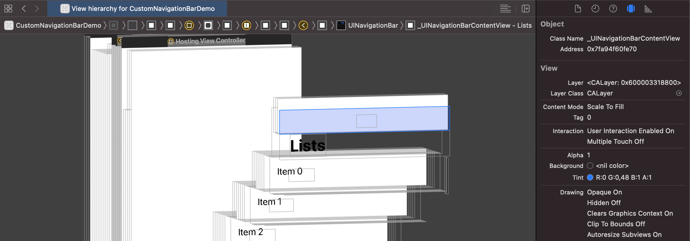

# Custom Navigation Bar Large Title View Demo in SwiftUI

The idea of this demo is to custom the navigation bar large title in SwiftUI.

## Example

- A navigation bar view should have 2 parts: the large title view and the trailing view. Make sure these 2 parts customizable.
- The navigation bar view should have the default behavior of the system's navigation bar with large title when user scrolls the list up and down.

 

## About view hierachy of the navigation bar

- Create new project
- In the file `ContentView.swift`, edit the default code with the following code:

```swift
/// ContentView.swift

struct ContentView: View {
    var body: some View {
        NavigationView {
            List {
                ForEach(0..<79) { index in
                    Text("Item \(index)").padding()
                }
            }
            .navigationBarTitle("Lists")
        }
    }
}
```

- Run the code in canvas, when we scroll the list up, the large title label will disappear, and the small title label will appear.



- Open the debug view hierachy mode.



- Check out the navigation bar view, the container view of the large title label and the container view of the small title label inside the navigation bar:

|  | When scrolling the list reach the top | When scrolling the list down |
|---|---|---|
| The container view of the large title label |  |  |
| The container view of the small title label |  |  |

- The container view of the large title label is type `_UINavigationBarLargeTitleView`.
- The container view of the small title label is type `_UINavigationBarContentView`.
- In short, when the large title view visually disappears on the UI by scrolling, the title will be shown on the content view.

## Custom the navigation bar

- To custom the navigation bar large title view and remain the scrolling default behavior, we need to do these things:
  - Create a structure adopting `UIViewControllerRepresentable` protocol.
  - Add an ovelay on top of the `_UINavigationBarLargeTitleView`
  - Create a customizable view for navigation bar

### Structure `UIViewControllerRepresentable` protocol

- Create a new file named `View+CustomNavigationBarLargeTitle.swift`
- Create a private struct `NavigationBarLargeTiltleRepresenting` which adopts `UIViewControllerRepresentable` protocol. This struct deploys any custom view, so this struct should be a generic type.
- Implement the struct `NavigationBarLargeTiltleRepresenting` by the following code:

```swift
/// View+CustomNavigationBarLargeTitle.swift

private struct NavigationBarLargeTiltleRepresenting<T: View>: UIViewControllerRepresentable {

    typealias UIViewControllerType = Wrapper

    private let customView: T

    init(customView: T) {
        self.customView = customView
    }

    func makeUIViewController(context: Context) -> Wrapper {
        Wrapper(representable: self)
    }

    func updateUIViewController(_ uiViewController: Wrapper, context: Context) { }
}

extension NavigationBarLargeTiltleRepresenting {

    class Wrapper: UIViewController {

        private let representable: NavigationBarLargeTiltleRepresenting

        init(representable: NavigationBarLargeTiltleRepresenting) {
            self.representable = representable
            super.init(nibName: nil, bundle: nil)
        }

        required init?(coder: NSCoder) {
            fatalError()
        }

        override func viewWillAppear(_ animated: Bool) {
            guard
                let navigationBar = navigationController?.navigationBar,
                let LargeTitleViewClass = NSClassFromString("_UINavigationBarLargeTitleView"),
                let largeTitleView = navigationBar.subviews.first(where: { $0.isKind(of:  LargeTitleViewClass.self) })
            else { return }
            let controller = UIHostingController(rootView: representable.customView)
            controller.view.clipsToBounds = true
            controller.view.translatesAutoresizingMaskIntoConstraints = false
            navigationBar.addSubview(controller.view)
            NSLayoutConstraint.activate([
                controller.view.leadingAnchor.constraint(equalTo: largeTitleView.leadingAnchor),
                controller.view.trailingAnchor.constraint(equalTo: largeTitleView.trailingAnchor),
                controller.view.bottomAnchor.constraint(equalTo: largeTitleView.bottomAnchor),
                controller.view.heightAnchor.constraint(equalTo: largeTitleView.heightAnchor)
            ])
            super.viewWillAppear(animated)
        }
    }
}
```

### Add overlay view

- In the same file `View+CustomNavigationBarLargeTitle.swift`, implement the overlaying function named `navigationBarLargeTiltle(customView:)`:

```swift
/// View+CustomNavigationBarLargeTitle.swift

public extension View {

    func navigationBarLargeTiltle<T>(customView: T) -> some View where T: View {
        overlay(NavigationBarLargeTiltleRepresenting(customView: customView).frame(width: 0, height: 0))
    }
}
```

### Create a customizable view

- Custom a view named `CustomNavigationBarLargeTitleView`. Make sure this view has 2 parts: title view and trailing view, and those 2 part are both customizable.

```swift
/// CustomNavigationBarLargeTitleView.swift

struct CustomNavigationBarLargeTitleView<TitleView, TrailingView>: View where TitleView: View, TrailingView: View {

    let titleView: () -> TitleView
    let trailingView: () -> TrailingView

    init(
        @ViewBuilder titleView: @escaping () -> TitleView,
        @ViewBuilder trailingView: @escaping () -> TrailingView
    ) {
        self.titleView = titleView
        self.trailingView = trailingView
    }

    var body: some View {
        HStack(alignment: .center) {
            titleView().padding()
            Spacer()
            trailingView().padding()
        }
    }
}
```

### Final touch

- Integrate the customizable navigation bar to the `ContentView`

```swift
/// ContentView.swift

struct ContentView: View {
    var body: some View {
        NavigationView {
            List {
                ForEach(0..<79) { index in
                    Text("Item \(index)").padding()
                }
            }
            .navigationBarTitle("Lists")
            .navigationBarLargeTiltle(
                customView: CustomNavigationBarLargeTitleView(
                    titleView: { Text("List").font(.largeTitle).fontWeight(.bold) },
                    trailingView: {
                        Circle()
                            .foregroundColor(.white)
                            .frame(width: 50, height: 50)
                            .overlay(Button(
                                action: { print("Hello") },
                                label: { Image("icon-cat").resizable()}
                            ))
                    }
                )
            )
        }
    }
}
```

## Result

Finally we have a navigation bar with large title of which the title component and the trailing component are customizable.

 