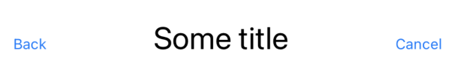

## Example

- A custom tiew should have 3 customizable views: leading view, content view and trailing view. These views stack horizontally.
- The content view has more prioritized than the leading view and the trailing view.
- Leading view, content view and trailing view can be any types which adopt **View protocol**.



## Code

```swift
/// CustomView.swift

struct CustomView<LeadingView, ContentView, TrailingView>: View
where LeadingView: View, ContentView: View, TrailingView: View {

    let leadingView: LeadingView
    let contentView: ContentView
    let trailingView: TrailingView

    var body: some View {
        HStack(alignment: .firstTextBaseline) {
            leadingView.padding()
            Spacer()
            contentView.layoutPriority(1).padding()
            Spacer()
            trailingView.padding()
        }
    }
}

struct CustomView_Previews: PreviewProvider {

    static var previews: some View {
        CustomView(
            leadingView: Button("Back", action: { }).font(.footnote),
            contentView: Text("Some title").font(.title),
            trailingView: Button("Cancel", action: { }).font(.footnote)
        ).frame(width: UIScreen.main.bounds.width, height: 100.0)
    }
}
```